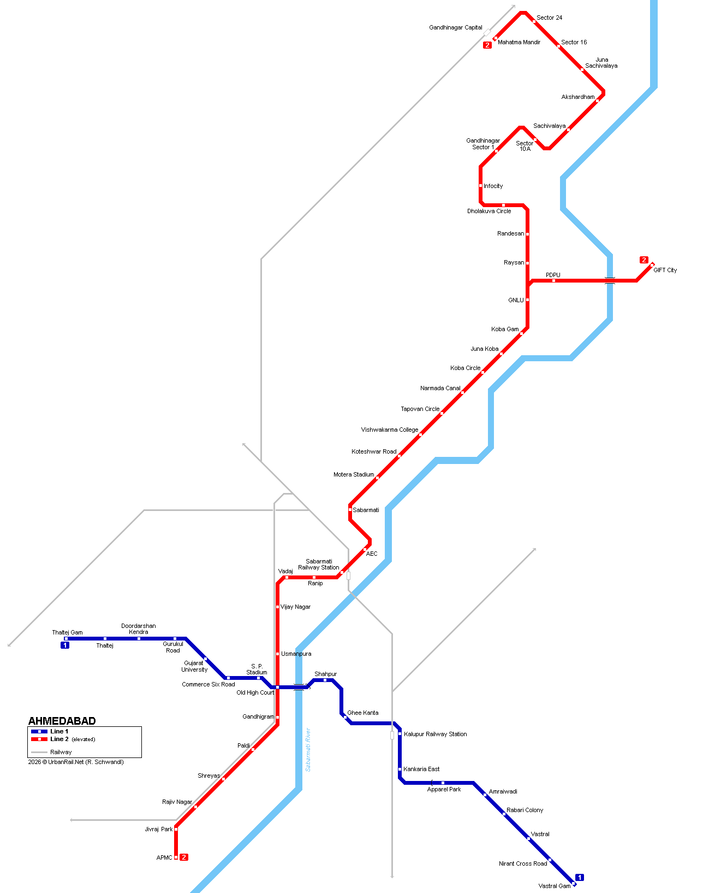

# Metrothi 🚇

<p align="center">
  
</p>

Metrothi is the ultimate, fully-functional companion application for the Ahmedabad Metro system. Built for speed and utility: open it, and within two seconds you know **which station to walk to, when the next train actually leaves, and exactly how to get where you're going** — including what ticket works, where to change lines, and whether the trip is even possible right now.

## 🚀 Features

- **Blazing Fast Routing:** Offline-capable journey planning using a deterministic ordered-array engine.
- **Honest Live Estimates:** Simulates live departures from actual GMRC timetables (no fake vehicle tracking).
- **Multimodal Ready:** Architecture supports geolocation resolving (search for "Stadium", route to "Motera Stadium").
- **Local-First:** Works entirely in airplane mode. The transit graph and timetables are bundled at build time and precached by the service worker; user data lives in `localStorage`.

---

## 🤖 For AI Assistants (How to Work with This Repo)

Welcome! If you are an AI assistant helping build or maintain Metrothi, here is your quick-start guide to the repository structure and rules. We rely heavily on agentic workflows, so please adhere strictly to these constraints.

### 1. The Master Reference: `files/Metrothi-PRD.md`
This is the single most important document in the project. 
**Before making any architectural, structural, or feature scope decisions, you MUST read `files/Metrothi-PRD.md`.** 
- It contains the complete product vision, scope (what we are *not* building), and the phased roadmap.
- Any new features or changes to the architecture must be documented there *first* before code is written.

### 2. Key Architectural Rules
- **Engine/UI Separation:** The core routing logic lives in `app/src/features/journey/engine/journeyEngine.ts`. This file is pure TypeScript with **zero React imports**. UI components (in `components/`) only call functions from this engine and render the results.
- **Design System:** Light and dark are both first-class — light is the default. All colors must use the CSS custom properties defined in `index.css` (e.g., `var(--c-bg)`, `var(--c-text)`, `var(--c-card)`, `var(--c-accent)` / `var(--c-accent-fg)`) rather than hardcoded hex values, so the theme toggle works. The four line colors (`LINE_COLORS`) are the exception — they map to real-world signage and stay fixed across themes.
- **No Real-time API (yet):** GMRC does not provide a live vehicle feed. We simulate "live" data using the static timetable logic inside `journeyEngine.ts`. **Never fake real-time tracking.**
- **Local-first Storage:** Transit data is bundled JSON, precached by the service worker; user data (saved stations, saved journeys, recent trips, theme) is written synchronously to `localStorage`. **Dexie/IndexedDB is deliberately not used** — see PRD §5.2. Supabase sync for authenticated users is still a future addition.
- **Ride time is not `totalMins`:** `totalMins` on a journey option is the platform wait *plus* the ride. Any figure presented as the trip's own duration must use `rideMinsOf()` instead, which starts at boarding. Getting this wrong bills an 8-minute hop as a two-hour journey when the app is opened before service starts. See PRD §5.5.
- **No stand-in station photos:** `stationImages.ts` only maps stations that have actually been photographed, and `stationImage()` returns `null` otherwise. **Never add a placeholder or a per-line fallback** — in a wayfinding app a photo of the wrong station is worse than no photo. Callers handle the miss by closing up the layout.
- **Shared departure rows:** Both departure lists (the home sheet's board and the station page's full-day schedule) render through `features/journey/components/DepartureRow.tsx`. They were hand-rolled separately once and drifted; don't fork it again.

### 3. Log What You Don't Fix: `DISCREPANCIES.md`
When you spot a bug or inconsistency that is **out of scope for the task you're on**, do not fix it inline and do not silently drop it — append it to `DISCREPANCIES.md` at the repo root, with the file path, line number, and enough context to act on later. Move an entry to the "Resolved / Fixed" section when it's actually fixed.

---

## 🛠 Tech Stack

- **Frontend:** React 19 + Vite + TypeScript
- **Styling:** TailwindCSS + Vanilla CSS (Custom Design Tokens)
- **Routing:** React Router v7
- **Mapping:** React Leaflet
- **Animations:** Framer Motion

## 📦 Getting Started

To run the application locally on your machine:

```bash
# Navigate to the frontend directory
cd app

# Install dependencies
npm install

# Start the Vite development server
npm run dev
```

Visit `http://localhost:5173` in your browser to view the application.

## 📝 License

This project is licensed under the MIT License.
